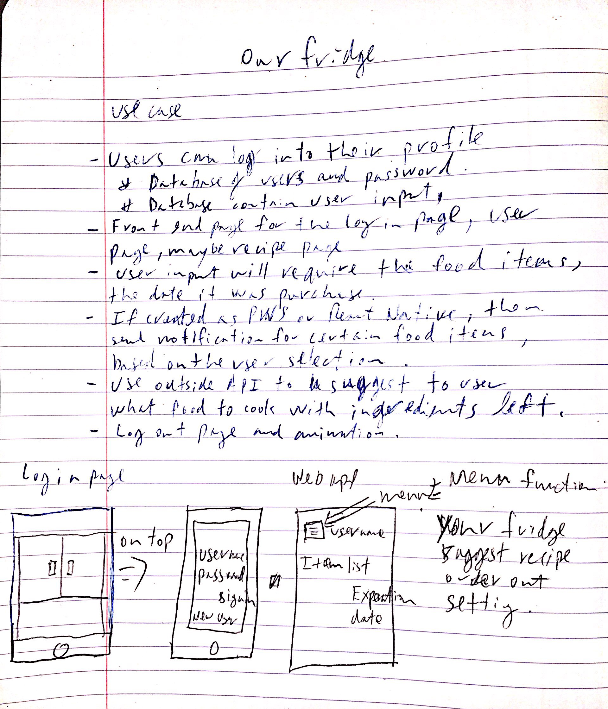

# Our Fridge web app.

## Why am I building this web app? (About)
I'm creating this web app for my wife. She's usually the person that goes groceries shopping and also cooks the meal for our family. Most of the time, she would forget what she bought and when and so most of the foods will either be rotten or go to waste. Hopefully, this web app will be useful for her to use and it will help her keep track of her purchases.

Above is my written documentation for what this app supposed to do. Below is a better, typed, version of what the use cases that I would like to accomplish within this app.

## Use cases to accomplish within this web app

- [ ] Login page that let the user access their groceries list.
- [ ] Have a login page, user page, maybe recipe page... _other order out services, i.e., Grub Hub or door dash_
- [ ] The user page will have an input text field that user can input their groceries item.
- [ ] Each groceries items will have the date that it was purchased... _have expiration dates for certain foods, i.e., milk._
- [ ] Have push notification for foods that are about to expire or based on the user input expires date for certain foods.
- [ ] Use outside API that has different recipes and use that to suggest a dish to the user, with whatever foods that are left in their list
- [] Log out page and animation

## What I would like to have but maybe not able to accomplish?

- [ ] Setting to add pictures to the user profile.
- [ ] Find some API that contains sales prices for the week.
- [ ] Voice recognition for the web app so that the user can talk to the web app and the web app will add the groceries based on what the user said.
- [ ] Camera scan functionality, so that users can take a picture of their receipt and the web app will automatically add those items into the user's account.

## How is this web app will be built?

I want to use either React or Vue to build the functionality/front end of this web app. Either React Native or learn more about PWS to create a mobile friendly and push notification. Use MongoDB to have a non-relational database to store users groceries items and also the date that it was purchased.

## When will this web app be done?

I will give myself two weeks to accomplish at least half of the use cases listed in the use cases section. That should at least get the web app up and running, so my wife would at least use it and doesn't think that I have been slacking for those two weeks.

## Conclusion

Thank you for reading my repository. I will try to get this done on my computer environment and then upload the codes onto this repository. I will then buy a domain to host this project since I think it might be a bit difficult to run this web app with GitHub pages.

Made with :heart:
